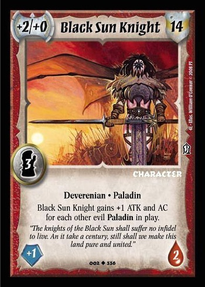

# Ideal Card DB
```
{
  id: number
  name: string
  cardType: 'warlord' | 'action' | 'item' | 'character'
  attack: array<number>
  armor: number
  level: number 
  alignment: 'good' | 'evil'
  class: array<string>
  image: string<path>
  save: number
  health: number
  traits: array<string>
  feats: array<string>
}
```

So for this character the entry would be:

```
{
  id: 0001,
  name: "Black Sun Knight",
  cardType: 'character',
  attack: [2, 0],
  armor: 14,
  level: 3 ,
  alignment: 'evil',
  class: ['fighter'],
  image: "/images/deck_1/c_black_sun_knight.jpg",
  save: 1,
  health: 2,
  traits: ['Deverenian', 'Paladin'],
  feats: []
}
```

## Deck Building
```
[
  card.id, 
  ...
]
```